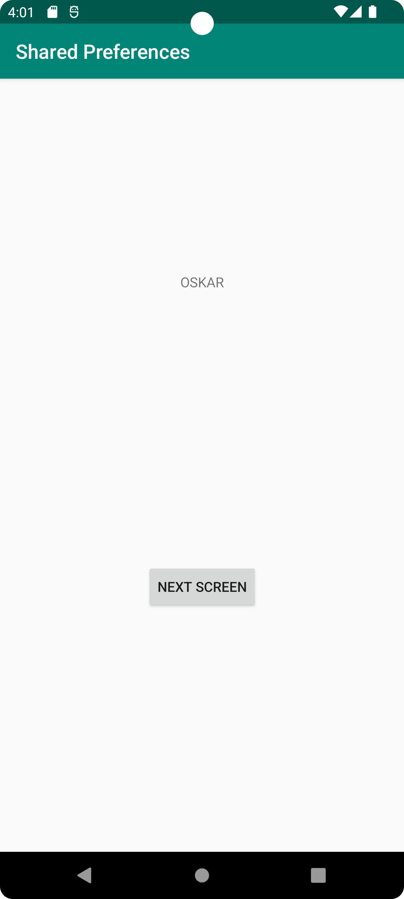
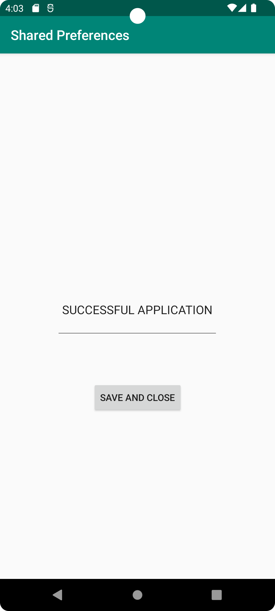
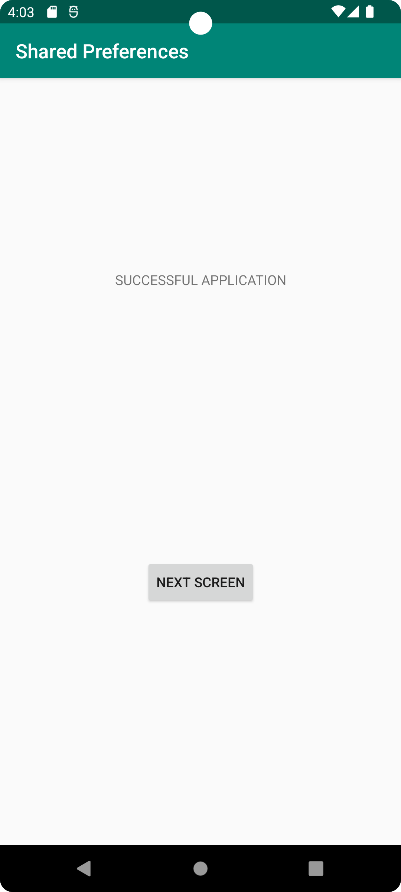

# Report

Created a SharedPreference object and editor.
Did commit and push to Github.

Updated textview with a new id.
Did commit and push to Github.

Added read from shared preferences to String
Added getters/setters for member variable myPreferenceData
Did commit and push to Github.

Adjusted position of textview and added a button to the layout file.
Did commit and push to Github.

Added a button object and attached a click listener.
Did commit and push to Github.

Removed getter and setter for myPreferenceData as they were never implemented.
Moved the code for reading shared preference data into method loadStringFromPreferences().
Added overridden onResume() method with code to load preference data when resuming MainActivity.
Did commit and push to Github.

Created SharedPreference object and added call to savePref() in button listener.
Added savePref() method to save data to shared preferences and then end activity.
Did commit and push to Github.

** Code example 1 - savePref() method **
```
public void savePref(View v) {
        // Get the text from EditText
        EditText newPrefText = (EditText)findViewById(R.id.settingsText);

        // Store the new preference text
        myPreferenceEditor.putString("MyPreferenceString", newPrefText.getText().toString());
        myPreferenceEditor.apply();

        Log.d("-->SecondActivity", "Saved value: " + newPrefText.getText().toString());

        // Start the MainActivity again
        Intent intent = new Intent(SecondActivity.this,MainActivity.class);
        startActivity(intent);

        // Clear the EditText
        newPrefText.setText("");

        // Finish the SecondActivity
        finish();
    }
```

Added "android:onClick='savePref'" to load method directly on button press.
Did commit and push to Github.

Removed the now redundant click listener from button.
Did commit and push to Github.

Did some cleanup of the code to remove unused references and other unnecessary things.
Did commit and push to Github.

Changed some hardcoded values to references to strings.xml instead.
Did commit and push to Github.

Changed the size of TextView and centered the text within.
Did commit and push to Github.

Moved hardcoded button text to strings.xml.
Did commit and push to Github.

Tested the app in the emulator to see that it worked according to requirements.
The result can be seen in the screenshots below.

** SCREENSHOT 1 - MainActivity at startup **


** SCREENSHOT 2 - SecondActivity after writing a value in EditText **


** SCREENSHOT 3 - MainActivity after closing SecondActivity and fetched the value from shared preferences **


Added images to report and did commit and push.

Did commit and push to upload this report.
